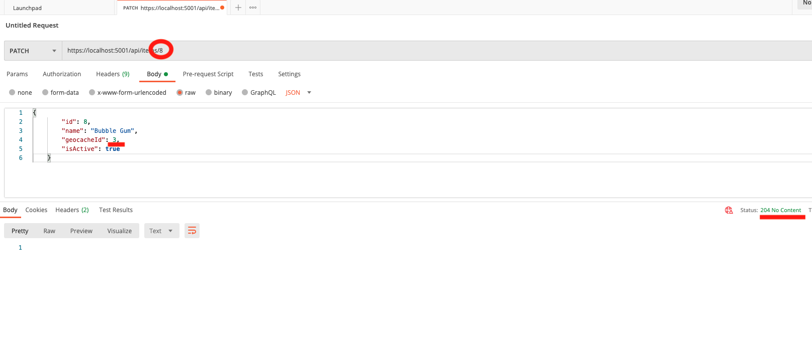

# Geocache API
Created 11.26.21 
By _**Jesse Callahan**_ 
Contact: _**Jessetylercallahan@gmail.com**_ 

## Setup/Installation Instructions

1. Clone repository
2. Navigate to the 'GeocacheAPI' folder in your terminal use the command 'dotnet restore' to load boilerplate.
3. Use the command 'dotnet ef database update' to run the SQLite database migration. 
4. Use command 'dotnet run' in your terminal to run server
5. Copy the local host 5000 server link into Postman or perferred API testing platform, copy 'http://localhost:5000/swagger/index.html' into your broswer url bar to test API with swagger

## Description
This application simulates the enormously popular Geocache game. 

### GET A LIST OF GEOCACHE LOCATIONS AND ACTIVE ITEMS
### GET /api/Geocaches/

### ADD A GEOCACHE LOCATION 
### POST /api/Geocaches/

### ADD AN ACTIVE ITEM TO A GEOCACHE LOCATION 
### (ONLY THREE ACTIVE ITEMS PER LOCATION)
### POST /api/Items/8

### MOVE AN ITEM TO NEW LOCATION 
### PATCH /api/Items/8
Make sure to add item id to url bar and add which Geocache Id you want to switch into

### GET LIST OF ALL ITEMS
### GET /api/Items/

### GET LIST OF INACTIVE ITEMS
### GET /api/Items/inactive

Full swagger documentation can found below.

## Specs

Visit the swagger docs website [here](https://app.swaggerhub.com/apis/jessetylercallahan/geocache-api/1.0#/)

This is more of a static version of documentation. If you want to interact with the API, run 'dotnet run' in your terminal and copy 'http://localhost:5000/swagger/index.html' into your browser url bar.

One-to-many database relationship:

## Technologies Used
* C#
* SQLite
* Web API
* Entity Framework
* LINQ
* .NET Asp Core

